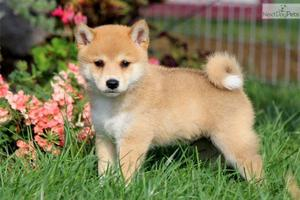
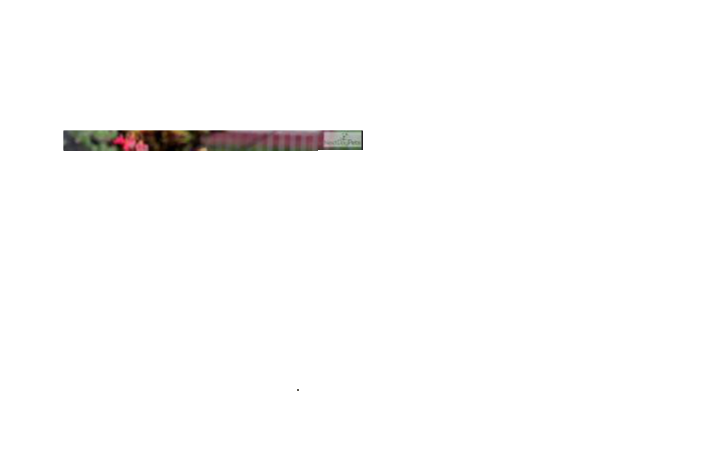

# PyCasso

## Attempting to Artistically Recreate Images in MS Paint

### Initial Image

  

  
  
### First Attempt

  

It works. But it takes about 3 seconds per pixel with 300x200 pixels. Trying to find a way to
manipulate MS Paint directly instead of using pyAutoGui. I also plan on skipping pixels and using wider
brush strokes to give off a more "painted" look. Right now it looks like it is copying the image pixel for pixel.
